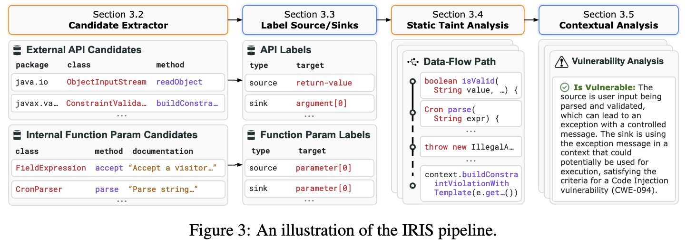
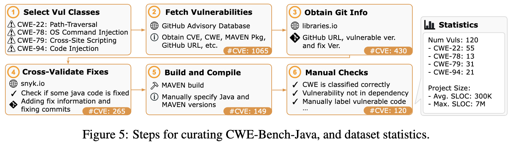
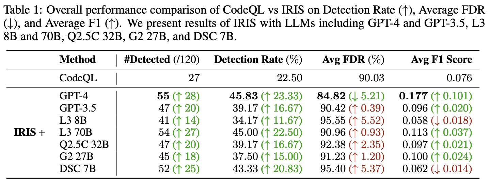

- [Overview](#overview)
	- [Challenges](#challenges)
	- [Contibutions](#contibutions)
- [Approach - IRIS](#approach---iris)
- [Dataset - CWE-Bench-Java](#dataset---cwe-bench-java)
- [Evaluation](#evaluation)
	- [Set-up](#set-up)
	- [Metrics](#metrics)
	- [漏洞检测能力](#漏洞检测能力)
	- [LLM推断source/sink specification能力](#llm推断sourcesink-specification能力)
	- [消融实验](#消融实验)
- [Notes](#notes)
		- [什么是Specifications?](#什么是specifications)

## Overview

IRIS: 整合LLM和static analysis用于whole-repository的漏洞检测推理

### Challenges

- 静态污点分析的局限：在漏洞检测时受限于人类定义的specificatiosns
	- 由于缺少第三方API的taint specifications导致漏报
	- 由于缺少准确的上下文和推理能力导致误报
- 现有LLM辅助程序分析的局限：
	- 由于context限制只能在method-level分析，难以分析库级别的代码

### Contibutions

1. approach：IRIS，使用LLM推理taint specifications，并进行contextual analysis
2. dataset：CWE-Bench-Java，120人工验证的真实世界Java漏洞。
3. results：在测试集上，IRIS比CodeQL多检测出28个漏洞；IRIS发现了4个新漏洞。

## Approach - IRIS

（1）使用LLM提取vulnerable sources & sinks （specifications）

（2）将提取的specifications转换成CodeQL查询语句

（3）使用CodeQL检测潜在漏洞路径

（4）使用LLM过滤CodeQL检测结果，输出漏洞检测结果

## Dataset - CWE-Bench-Java

共120个存在漏洞的Java项目

- vulnerability metadata: CWE ID, CVE ID, fix commit, vulnerable project version
- project is compilable (可以用于static analysis)
- real-world
- 验证vulnerability & location (method)

## Evaluation

### Set-up

- LLMs: gpt-4, gpt-3.5, llama3 (8B, 70B), Qwen-2.5-Coder (32B), Gemma-2 (27B), DeepSeekCoder (7B)
- static analysis tools: CodeQL 2.15.3 (built-in Security queries)

### Metrics

- 漏洞检测数量 \#Detect：成功检测出漏洞路径的项目数
	- 检测出的漏洞路径数 \#VulPath(P)：包含patch中修复method的路径
- 误报率 AvgFDR：所有项目的平均误报率
	- 项目级召回率 Rec(P)：若\#VulPath(P) > 0，则 Rec(P)=1
	- 项目级精确率 Prec(P) = \#VulPath(P) / \|Paths^P\| ：项目中，检测出的漏洞路径占检测出的总路径的比例。
	- 项目级别误报率：1 - Prec(P)
- AvgF1：所有项目的平均F1

### 漏洞检测能力

（1）数据集实验结果

（2）unknown vulnerabilities

在30个项目的最新版本中使用IRIS进行检测，成功发现了4个CodeQL由于缺少specification无法检测出的新漏洞。

### LLM推断source/sink specification能力

（1）使用CodeQL污点分析specifications作为benchmark

> we used CodeQL’s taint specifications as a benchmark to estimate the recall of both source and sink specifications inferred by LLMs

（2）人工分析960个随机samples

> we manually analyzed 960 randomly selected samples of LLM-inferred source and sink labels (30 per combination of CWE and LLM) and estimated the overall precision of the specifications

### 消融实验

## Notes

#### 什么是Specifications?

*   本文中指vulnerable sources, sinks and sanitizers，实际在使用LLM提取时只考虑了sources & sinks。

> static taint analysis predominantly relies on *specifications* of third-party library APIs as sources, sinks, or sanitizers
