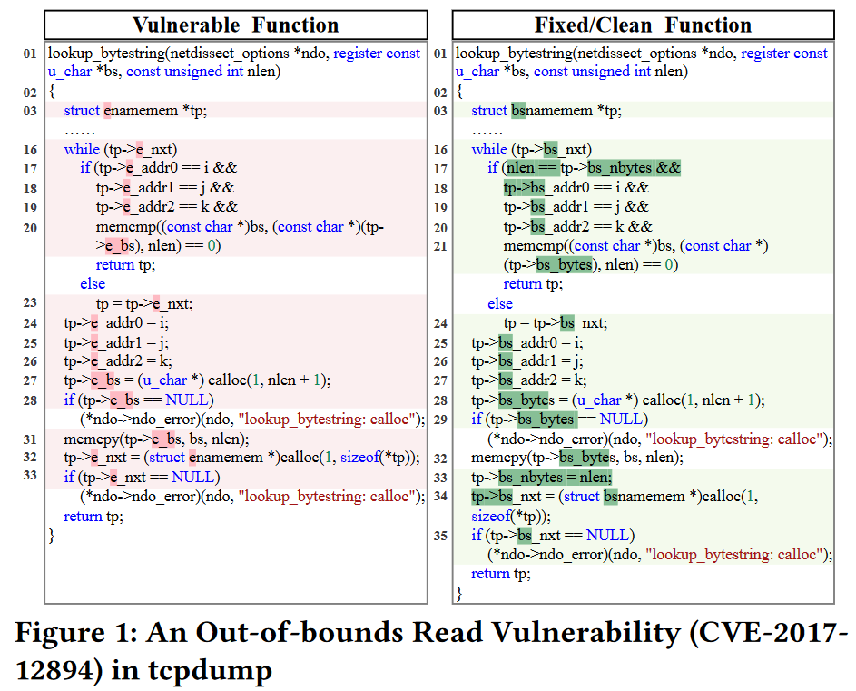
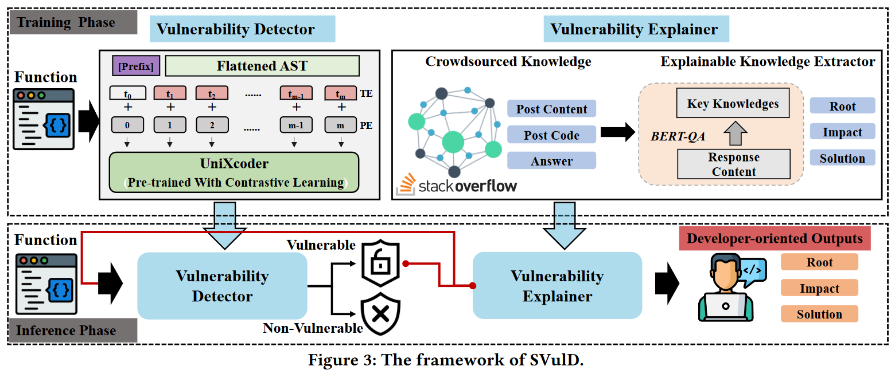
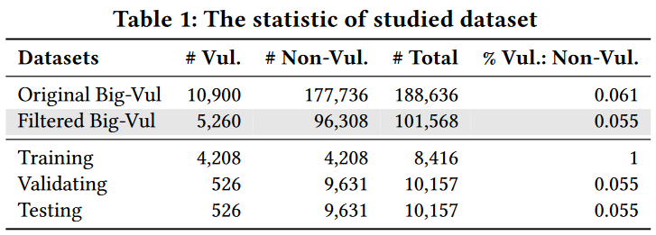

# Distinguishing Look-Alike Innocent and Vulnerable Code by Subtle Semantic Representation Learning and Explanation

基于预训练语义嵌入和对比学习进行函数级别的subtle semantic embedding，用于检测漏洞并提供直观解释。

code: <https://github.com/jacknichao/SVulD>

现有基于深度学习的漏洞检测方法（1）对于词汇（lexical）相似但语义（semantic）相反的函数预测效果不好（2）没有向开发者提供直观的检测结果

SVulD是一种函数级别的细粒度语义嵌入方式，用于检测漏洞并提供直观的解释。SVulD首先训练模型用于学习（不考虑词汇相似性的）区分函数的语义表示，然后对于检测到漏洞的函数SVulD提供导致漏洞的自然语言解释（root cause）用于帮助开发人员直观地理解漏洞。

将SVulD与4种sota工具在5个指标下进行比较，SVulD均表现更好。此外，通过用户调研证明了SVulD帮助开发者理解漏洞代码的有效性。

## Introduction

自动漏洞检测方法分为静态分析的方法和深度学习的方法。静态技术需要专家知识并专注于检测type-specific vulnerabilities (i.e., UAF)，而深度学习的方法从现有漏洞代码中提取程序语义用于检测潜在类型不可知的漏洞。

但现有基于深度学习的检测方法
（1）难以区分词汇相似函数的细微语法差别，而大部分漏洞函数的修改都只涉及几行代码。同时，作者发现漏洞函数和已修复函数通常在词汇上非常相似，但是在语法上有很大差别。但目前的基于深度学习的检测方法难以识别修复后的函数，因此会导致高误报。
（2）现有漏洞检测方法通常只给出结果是否存在漏洞的二分结果，没有给出漏洞原因和影响的具体解释。

本文提出SVulD，基于预训练语义嵌入和对比学习（contrastive learning）进行函数级别的细微语义嵌入，用于漏洞检测并提供直观解释。SVulD首先使用对比学习训练UniXcoder语义嵌入模型，用于学习（不考虑词汇相似性的）区分函数的语义表示。并通过从stack overflow爬取代码构建数据集来微调BERT，实现为开发人员提供直观漏洞解释。

将SVulD与四个sota方法（Devign, ReVeal, IVDetect, and LineVul）在5个指标下（Accuracy, Precision, Recall, F1-score, and PR-AUC）进行比较，SVulD均表现更好。此外，通过用户调研证明了SVulD帮助开发者理解漏洞代码的有效性。

## Motivation

## Approach

## Experiment

### Datasets

*   [Big-Vul](https://github.com/ZeoVan/MSR_20_Code_vulnerability_CSV_Dataset) ([Fan et al. MSR 2020](https://dl.acm.org/doi/abs/10.1145/3379597.3387501))

使用[Fan et al. MSR 2020](https://dl.acm.org/doi/abs/10.1145/3379597.3387501)提出的数据集[Big-Vul](https://github.com/ZeoVan/MSR_20_Code_vulnerability_CSV_Dataset)。Big-Vul 总共包含从 2002 年至 2019 年从 348 个开源项目收集的 3,754 个代码漏洞，涵盖 91 个不同的漏洞类型。

由于部分baseline方法需要函数结构信息，如果使用Joern无法成功生成函数的CFG或DFG，则过滤掉该函数。

*   Crowdsourced Dataset
