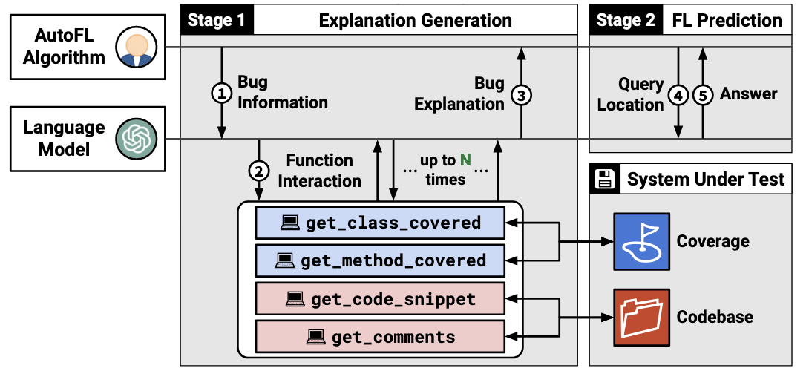
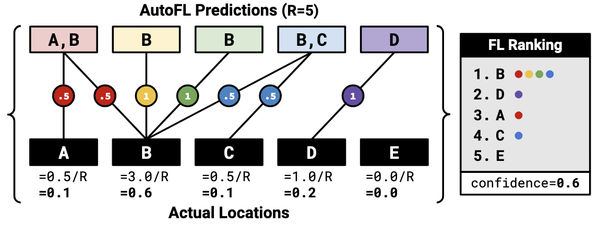

先前的方法缺少对suggested locations的解释，本文提出AutoFL，“prompts an LLM to use function calls to navigate a repository”。

## Contributions

- 方法：使用LLM驱动的代码相关信息检索，使用LLM完成漏洞定位及解释；
- 漏洞定位性能：AutoFL在2个真实世界bug benchmarks上较baselines表现更好；
- 定位解释性能：对超过半数的漏洞可以给出准确解释，开发者对AutoFL生成的解释持积极态度。

## Approach

目标: generate logical flow from the root cause to the failure

- method-level fault location

stage 1: 分析root cause

(1) prompt (bug information): failing test + 相关函数描述

(2) retrieve (function interaction): LLM驱动的信息获取

- 使用LLM决定提取哪些信息，以及是否进行explanation。
- 一共有4种信息：class-level coverage information, method-level coverage information, method code, method comments. 
- 其中，method code和method comments需要LLM提取的method signatures作为输入。

(3) explain: LLM根据提取的信息生成root cause explanation

stage 2: 获取fault location输出

(4) predict: LLM预测具体fault method

(5) ranking: 使用LLM多次预测fault method，计算score对method排序，并以最高score作为confidence。

$$\text{score}(m) = \frac{1}{R} \sum_{k=1}^{R} \left( \frac{1}{|r_k|} \cdot [ m \in r_k ] \right)$$

其中，$r_k$ 表示第k次预测中，预测得到的fault method总数；R为总预测次数。

## Related work

- Xueying Du, Yiling Lou, Mingwei Liu, Xin Peng, and Tianyong Yang. 2023. KG4CraSolver: Recommending Crash Solutions via Knowledge Graph. In Proceedings of the 31st ACM Joint European Software Engineering Conference and Symposium on the Foundations of Software Engineering (ESEC/FSE ’23). ACM. https://doi.org/10.1145/3611643.3616317