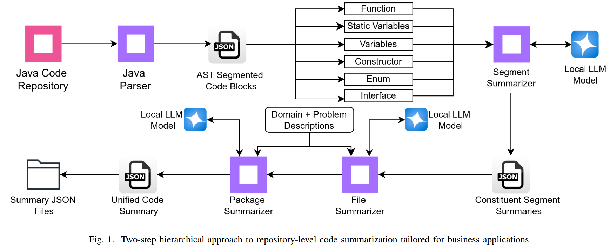

Hierarchical Repository-Level Code Summarization  for Business Applications Using Local LLMs

\[summary] two-step hierarchical approach for repository-level code summarization

（1）总结smaller code units（functions & variables）：使用syntax analysis & summarized

（2）生成higher-level file & package summaries

## Contributions

*   代码总结方法：two-step hierarchical approach for repository-level source code summarization using local LLMs
*   prompt方法：适用于business applications context的代码总结prompt，特别关注实施细节。
*   效果：在通信领域的business support system application中评估

## Approach

### 使用AST分割代码块

对于以function, variables, constructor, enum, interface类型的nodes为根节点，提取subtree作为代码块。

### 代码块级别的代码总结（segment-level summary）

为每种类型的代码块定义总结方式

*   function: name, input, output, workflow, side effects, and purpose
*   constructor: 用于定义class creation的关键属性
*   variable: type, scope, and role in the code
*   enum: constant值及其作用
*   interface: intended purpose of methods

### 库级别的代码总结

（1）file-level summary: 同时考虑segment-level summary以及domain and the problem context

（2）package-level summary: 使用file summary生成

### business application中应用

（1）在prompt中告诉LLM应用领域

（2）在prompt中提供problem context

