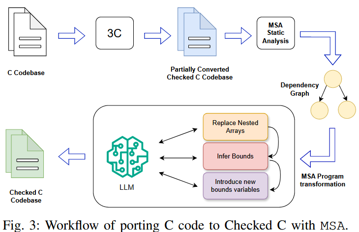
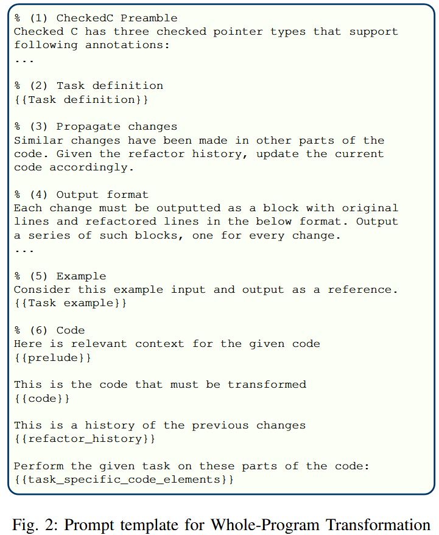

LLM Assistance for Memory Safety

\[summary] 使用LLM结合symbolic来实现C->内存安全的C dialect（Checked C）的转换

为了保证内存安全，一个重要的手段就是将已有C代码转换为内存安全的C dialect（方言）。这样的dialects依赖大量程序员提供的注释来保证总体minimal runtime（最小运行时间），从而保证安全性。

而要将C转换为C dialect，需要两个步骤：1）推断注释，2）重构/重写代码以符合注释。虽然现在有利用symbolic analyse来自动进行转换的方式，但效果并不理想。

所以文章提出使用LLM结合symbolic来实现C->Checked C的转换。为了使转换适用于LLM，作者构建了一个whole-program transformations的框架MSA（也就是文章提出的转换流程），分步进行转换。并使用CheckedC dialect评估这个框架，与symbolic以及LLM baseline比较，发现MSA的表现大大的好。

## Approach

1.  使用3C tool生成partially converted CheckedC code
2.  使用静态分析生成dependency graph：节点为top-level declarations，包括**procedures** (both its signature and its body), **type** declarations (struct, union, enum), **global** variable declarations and **macro** definitions.
3.  使用LLM进行Replace Nested Arrays, Infer Bounds, Introduce new bounds variables，完成转换。

---

## Porting C->Checked C

什么是Checked C？ Checked C里的代码可以分为两部分，checked & unchecked。checked的部分可以保证spatial memory safety，这部分只要有OOB程序就会终止。所以任何内存非法访问都是unchecked部分的问题。

## 论文逻辑

1.  Introduction

    1.  为什么C语言memory safety很重要（很多漏洞都是由memory safety问题导致的）
    2.  引出用于保护C语言安全的dialects，进行简单介绍，并指出存在的问题。
    3.  引出LLM，指出LLM的优势。介绍本文结合LLM优势开发的用于port C -> Checked-C的工具，总体说明本文工具的意义。
    4.  main contribution
    5.  具体介绍本文的工作各部分的优势与意义（LLM，symbolic与Checked C compiler互相补足）
    6.  该工具的future extention以及在其他任务上的应用价值
    7.  分点介绍contributions

2.  Background

    *   checked C
    *   examples of the porting process from C

3.  用于Checked C inference的符号执行工具

4.  本文提出的基于LLM的转换框架（MSA）

5.  转换框架的应用实例

6.  评估实验

7.  threats to validity

8.  相关文献
