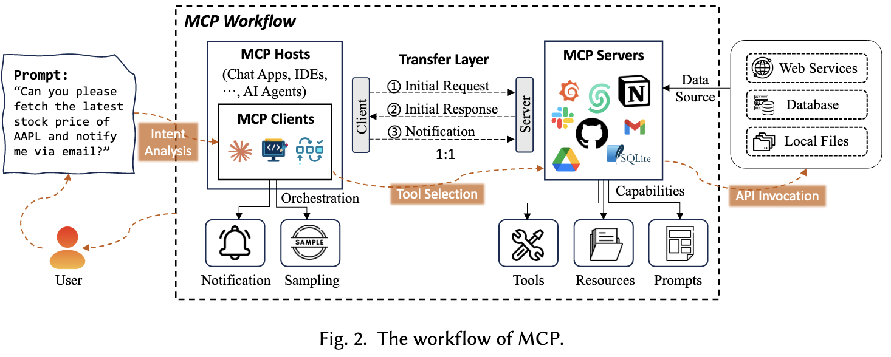
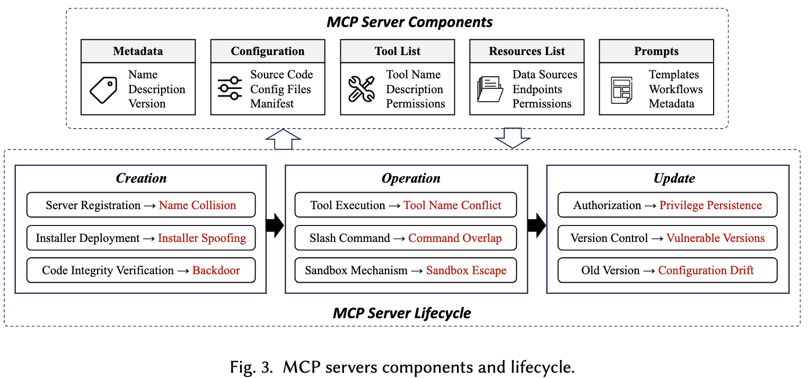
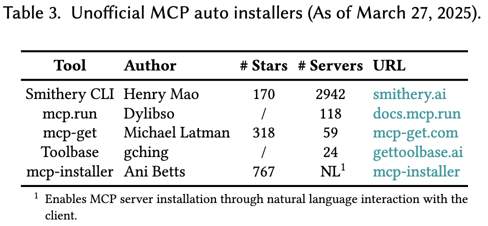
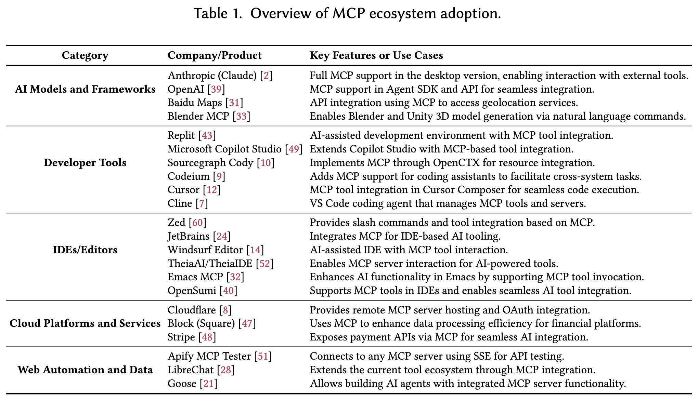

Model Context Protocol (MCP): Landscape, Security Threats, and Future Research Directions

对MCP的架构及现有应用情况进行介绍，并分析其潜在安全问题，指出未来研究方向。

## Background

Limitation of current AI tools

*   **Manual API Wiring:** required custom authentication, data transformation, and error handling for every integration
*   **Standardized Plugin Interfaces:** (1) one-directional and could not maintain state or coordinate multiple steps in a task, (2) platform-specific
*   **AI Agent Tool Integration** (e.g., LangChain):  largely manual, requiring custom implementations
*   **Retrieval-Augmented Generation** (RAG): limited to passive retrieval of information, cannot update data or trigger workflows.

## MCP Architecture

### Core Components

*   **MCP Hosts**: AI application that provides the environment for executing AI-based tasks while running the MCP client.

*   **MCP Client**:

    *   processes notifications from MCP servers
    *   performs sampling to gather data

*   **MCP Server**: managing external tools, sources, and prompts

    *   Tools: Enabling external operations
    *   Resources: Exposing data to AI models
    *   Prompts: Reusable templates for workflow optimization

*   **Transfer Layer**

    *   initial request: query the server’s functionalities
    *   initial response: listing the available tools, resources, and prompts
    *   exchange of notifications

## MCP Server Lifecycle & Security Threats

### Creation Phase

*   Name Collision

    *   malicious server can register a similar name to legitimate server
    *   %% 恶意实体通过注册与合法MCP Server相似或相同的名称，欺骗用户安装恶意Server。 %%

*   Installer Spoofing

    *   unofficial auto-installers install unverified malware
    *   %% 来自非官方渠道的自动安装工具可能会安装未经验证的软件包 %%

*   Code Injection / Backdoor

    *   malicious code embedded into the MCP server’s codebase

### Operation Phase

*   Tool Name Conflicts

    *   malicious tool can register a similar name to legitimate tool

*   Slash Command Overlap

    *   multiple tools can register similar commands (e.g., /delete: A. remove temporary, B. erase critical system logs)

*   Sandbox Escape

    *   break out of the restricted environment and gain unauthorized access to the host system

### Update Phase

*   Post-Update Privilege Persistence

    *   outdated privileges remain active after an MCP server update (e.g., API key)

*   Re-deployment of Vulnerable Versions

*   Configuration Drift

    *   manual adjustments, overlooked updates, or conflicting modifications made
    *   unintended changes accumulate in the system configuration

## MCP Current Landscape

## Future Directions

### Challenges

*   Lack of centralized security oversight
*   Authentication and authorization gaps
*   Insufficient debugging and monitoring mechanisms
*   Maintaining consistency in multi-step, cross-system workflows
*   Scalability challenges in multi-tenant environments: consistent performance, security, and tenant isolation
*   Challenges in embedding MCP in smart environments: real-time responsiveness, interoperability, and security

### Suggestions

*   MCP maintainers

    *   establish a formal package management system
    *   centralized server registry
    *   implementing a secure sandboxing framework

*   developers

    *   adhering to secure coding practices and maintaining thorough documentation
    *   automate configuration management to mitigate configuration drift

*   researchers

    *   version control and package management in decentralized ecosystems
    *   sandbox security, mitigate privilege persistence, prevent configuration drift
    *   context-aware agent orchestration in multi-tool environments %% ensuring state consistency and preventing tool invocation conflicts %%

*   end-users

    *   using verified MCP servers
    *   regularly updating MCP servers and monitoring configuration changes

