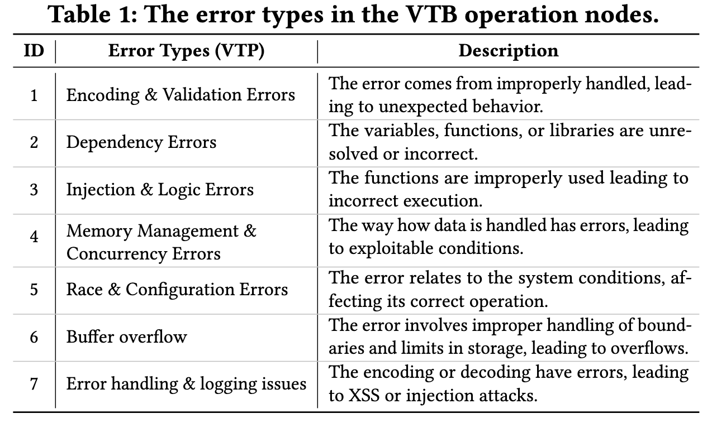
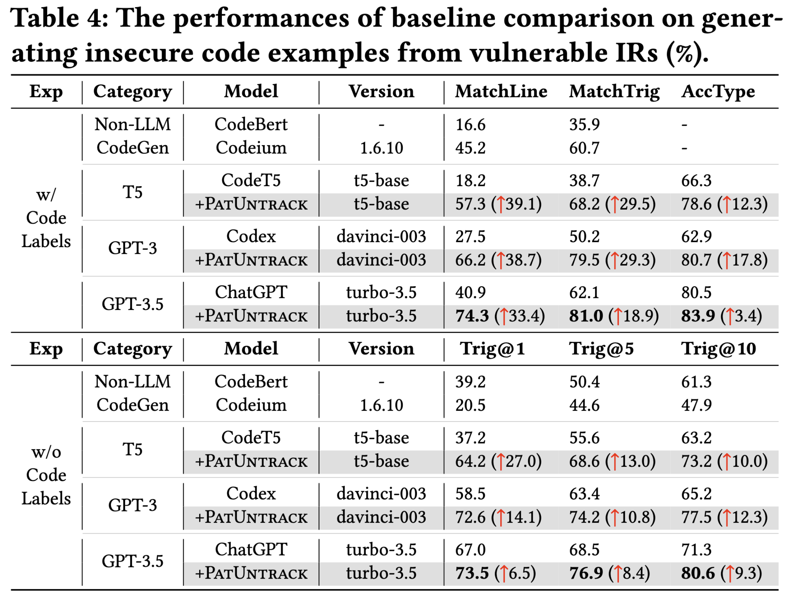
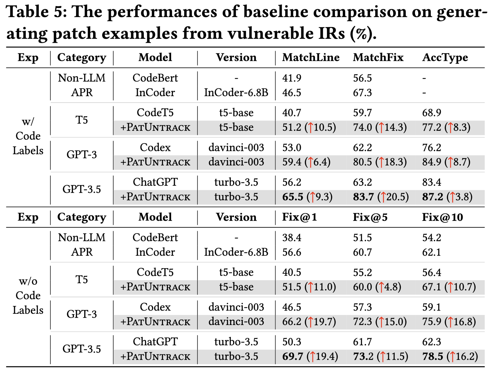
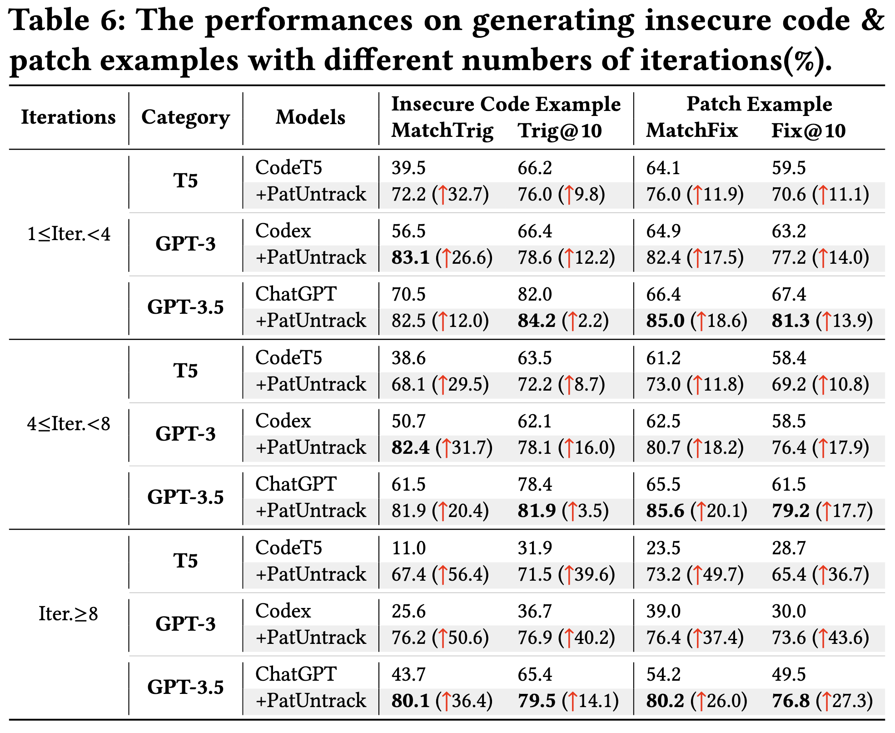
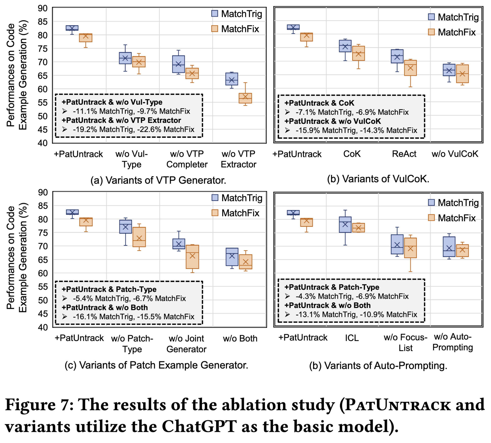
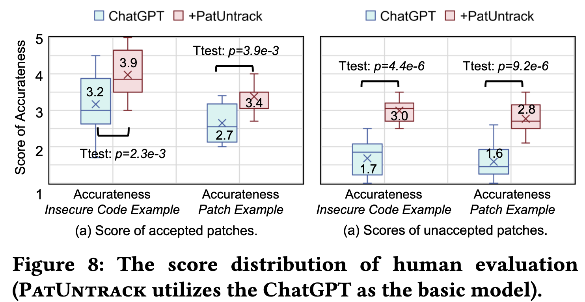
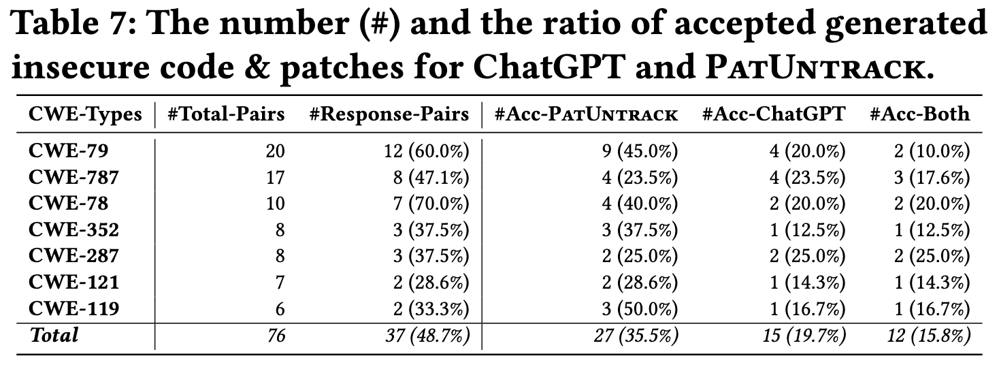

从issue report中提取description of vulnerability triggering path (VTP)，用于辅助patch example生成。

*   使用auto-prompting生成与vulnerability type，error type对应的focus list，以及patch type list
*   整体设计：issue report -> initial VTP -> complete VTP -> hallucination corrected VTP -> patch example

### What is the description of vulnerability triggering path (VTP)?

$VTP = {Op_{0}, Op_{1}, …, Op_{T}}$

其中，$Op_{i}$ 代表第i个operation，用<操作类型，操作描述，漏洞类型>三元组表示：

$Op_{i} = <Op_{Type}, Op_{Desc}, Vul_{Type}>$

其中，操作类型由人工总结包含：

【因为文章定义了Vulnerability-Triggering Path的重要特征，是从source通过数据流进行tainted最终到达sink，所以在定义operation的时候会更加清晰，着重于数据的传播操作。】

*“we manually  analyzed the IRs with experienced security practitioners who participated in our data annotation to determine the types of operation  nodes/edges with Open Card Sorting”*

Operation Types:
- Src-Load
- Func-Call
- VulData-Transmit
- SecData-Transmit
- Vul-Trigger

而漏洞类型包含CWE漏洞类型，以及Error类型两部分，其中Error类型包括：

Vul\_{Type}: CWE type + Error type

### What is the focus list and how to generate it by auto-prompting?

focus list: 一组由基于训练数据集进行auto-prompting后得到的与CWE type / error type相对应的操作集合。

auto-prompting:

(1) update 3 times: "Please update the prompt by inserting\|deleting\|modifying the \[item]  to the prompt’s focus f ", where \[item] is the sample used to optimize the prompt.

(2) score 3 prompts: 使用score function计算最佳prompt，作为后续使用的prompt。

【很可惜focus list这部分并没有开源，搞不明白到底会输出什么。】

### Hallucination Detection & Correction

*   让LLM生成数据库的查询指令，检索相关信息。
*   使用检索到的信息，利用LLM判断是否存在幻觉。
*   如果存在幻觉，则输出幻觉相应节点及边，并使用LLM修正。

### Patch example generation

*   在patch type list中选取合适的patch type
*   整合patch type，patch example信息进行生成

## Evaluation

### Metrics

MatchLine: 与ground-truth语句重合的比例

MatchTrig: 与patch删除语句重合的比例

MatchFix: 与patch添加语句重合的比例

AccType: CWE和error type预测准确率

### Experiments

（1）generate insecure code

测试生成的insecure code是否与ground-truth一致 / 能够触发相关漏洞

（2）generate patch example

测试生成的patch是否与ground-truth一致 / 可以通过test case

（3）根据initial VTP -> complete VTP 循环次数，将结果分为<4, <8, >=8三组。循环次数越大，则代表issue report越不完整。

生成性能随着 issue report 信息量减少而下降，但PatUntrack性能始终最好。

（4）ablation

（5）human evaluation

